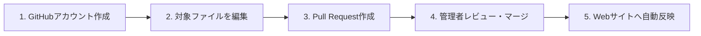

# 編集・貢献ガイド (Contribution Guide)

『**World of Reverse:1999**』は、有志によるオープンな二次資料アーカイブ（まとめノート）です。  
ゲーム『リバース：1999』の世界観・設定・ストーリー・登場人物・年表について、誤字脱字の修正、新しい情報の追加、より正確なエビデンス（作中描写）の補足など、**皆さまからの加筆・修正提案（プルリクエスト）を広く歓迎**しています。

---

## 編集・提案の流れ

本サイトは GitHub リポジトリ（[kojisaiki/world-of-reverse1999](https://github.com/kojisaiki/world-of-reverse1999)）上で Markdown ファイルとして管理されており、GitHub の **Pull Request（プルリクエスト）** 機能を通じて誰でも安全に編集を提案できます。



---

## 具体的な手順

### ステップ 1: GitHub アカウントを用意する
編集や提案を行うには GitHub アカウントが必要です（無料）。  
お持ちでない場合は、[GitHub 公式サイト](https://github.com/signup) からアカウントを作成してください。

---

### ステップ 2: ファイルを編集する

お好みに応じて、以下のいずれかの方法で編集できます。

#### 方法 A: Webブラウザ上で編集する（おすすめ・最も簡単）
PCやスマートフォンのブラウザだけで手軽に編集できます。Git コマンドの知識は不要です。

1. GitHub リポジトリ（[https://github.com/kojisaiki/world-of-reverse1999](https://github.com/kojisaiki/world-of-reverse1999)）にアクセスします。
2. 編集したいページに対応する Markdown ファイルを探して開きます。
   - 例: キャラクター情報なら `character/` フォルダ配下のファイル
   - メインストーリーなら `story/main/` フォルダ配下のファイル
3. ファイル表示画面の右上にある **鉛筆アイコン（Edit this file）** をクリックします。
   - ※ 初回は自動的にあなたの GitHub アカウントへフォーク（リポジトリの個人用コピー）が作成されます。
4. エディタ上で内容を追記・修正します。

#### 方法 B: ローカル環境（Obsidian / Git）で編集する
本格的な執筆や複数ファイルの構造変更を行う場合は、リポジトリを Fork & Clone して編集します。

1. リポジトリを Fork してローカルに Clone します:
   ```bash
   git clone https://github.com/<あなたのユーザー名>/world-of-reverse1999.git
   ```
2. お好みの Markdown エディタ（[Obsidian](https://obsidian.md/) 推奨）でフォルダを開いて編集します。
3. トピックブランチを作成し、コミットしてご自身のリポジトリに Push します。

---

### ステップ 3: プルリクエスト（Pull Request）を作成する

1. ファイルの編集後、画面下部の「**Propose changes**（変更を提案）」をクリックします。
2. 変更内容がわかるタイトルと簡単な説明を入力します。
   - 例: `〇〇の誤字修正`, `Ver.2.0「ウル」のストーリー登場記録を追加` など
   - ストーリーや設定の追加の場合は、ゲーム内の登場箇所（第〇章、イベント名、台詞など）のエビデンスを簡単に添えていただけると確認がスムーズになります。
3. 「**Create pull request**」をクリックして送信します。

---

### ステップ 4: レビューと自動反映

管理者が変更内容を確認し、問題がなければリポジトリにマージ（統合）されます。  
マージが完了すると、GitHub Actions により自動でビルドが行われ、数分以内に本 Web サイトに反映されます。

---

## 執筆・編集ルール

品質と一貫性を保つため、以下の編集方針にご協力をお願いします。

### 1. エビデンス主義（客観的描写の重視）
- ゲーム本編のストーリー、台詞、プロファイルテキスト、公式設定資料などの**「作中エビデンス」に基づく記録**を基本とします。
- 考察や個人的な推測を記述する場合は、客観的事実と混同しないよう「〜と推測される」「考察:」などの表現を明記してください。

### 2. 内部リンク記法
- Obsidian と GitHub の両方で正常にハイパーリンクとして機能させるため、内部リンクは必ず **`[[ノート名]](相対パス)`** の形式で記述してください。
  - 例: `[[ストーム]](event/storm/ストーム.md)`
  - 例: `[[ヴェルティ]](ヴェルティ.md)`
  - 例: `[[第1章「われらの時代」]](../story/main/第1章_われらの時代.md)`

---

## ご意見・誤字報告（Issue）について

「プルリクエストの作り方がよくわからない」「情報の誤りや要望だけを伝えたい」という場合は、[GitHub Issues](https://github.com/kojisaiki/world-of-reverse1999/issues) から報告トピックを作成していただくことも大歓迎です。
